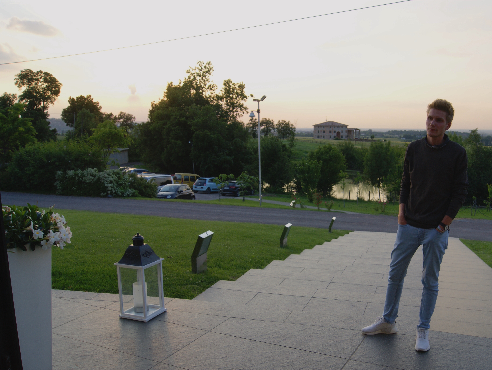

Servus 👋, ich bin Bernhard, Masterstudent <Text sx={{ fontSize: [1, 2, 2], fontWeight: `bold`, color: `heading` }}>Informationsmanagement</Text>
und auf dieser Seite erfährst du etwas über mich.
Ich bin an vielen Informatik-Themen interessiert, wie Cloud Computing, IT Service Management, Netzwerktechnik und IoT.

<Text sx={{ fontSize: [3, 4, 5], fontWeight: `bold`, color: `heading` }}>
  Ausbildung
</Text>

FH Joanneum, Graz, Master (aktuell in Ausbildung)<br/><a href="https://www.fh-joanneum.at/it-architecture/master/" target="_blank">Informationsmanagement / IT Architecture</a>

FH Joanneum, Graz, Bachelor <br/><a href="https://www.fh-joanneum.at/gesundheitsinformatik/bachelor/" target="_blank">Gesundheitsinformatik / eHealth</a>

HTL Wolfsberg, Reife- und Diplomprüfung <br/><a href="https://www.htl-wolfsberg.at/ausbildung.html#Betriebsinformatik" target="_blank">Wirtschaftsingenieurwesen - Betriebsinformatik</a>

<Text sx={{ fontSize: [3, 4, 5], fontWeight: `bold`, color: `heading` }}>
  Kontakt
</Text>

Wenn du Fragen oder Anregungen hast, kannst du mich gern per [E-Mail](mailto:ebner.bernhard98@gmx.at?subject=Anfrage%20(Website)) kontaktieren.

<Text sx={{ fontSize: [3, 4, 5], fontWeight: `bold`, color: `heading` }}>
  Lebensmotto
</Text> <br/><br/>

```tsx
//Life motto
if(sad) {
   sad = false;
   beAwesome();
}
```

<style>
<br/>

<Text sx={{ fontSize: [3, 4, 5], fontWeight: `bold`, color: `heading` }}>
  Standort
</Text> <br/><br/>

<iframe src="https://www.google.com/maps/embed?pb=!4v1648566467671!6m8!1m7!1sg6e_UDJZld0ODWQ1jdgPwA!2m2!1d47.07378696174419!2d15.43745630477839!3f147.8448337787713!4f12.910744019807836!5f0.7820865974627469"
width="100%" height="400" style="border:0;" allowfullscreen=""
loading="lazy" referrerpolicy="no-referrer-when-downgrade">
</iframe> <br/>
</style>

