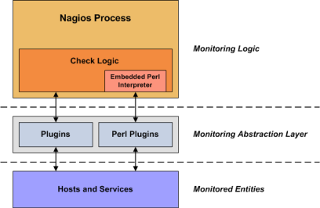
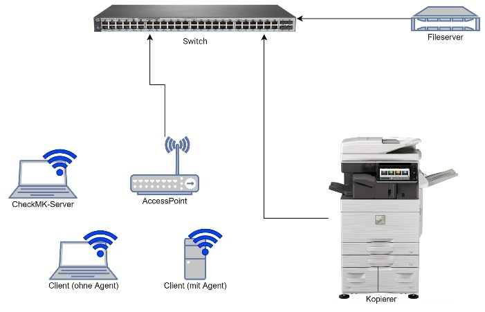
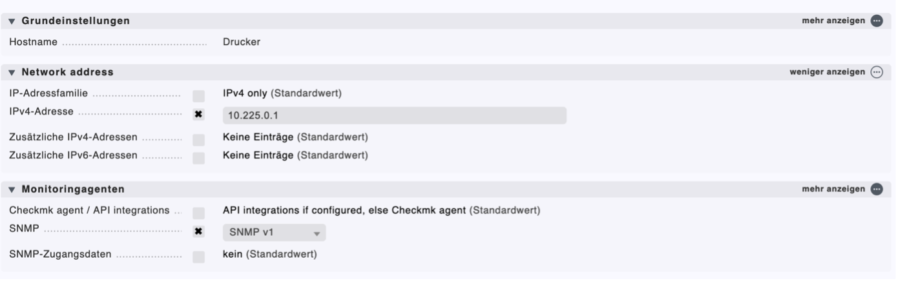
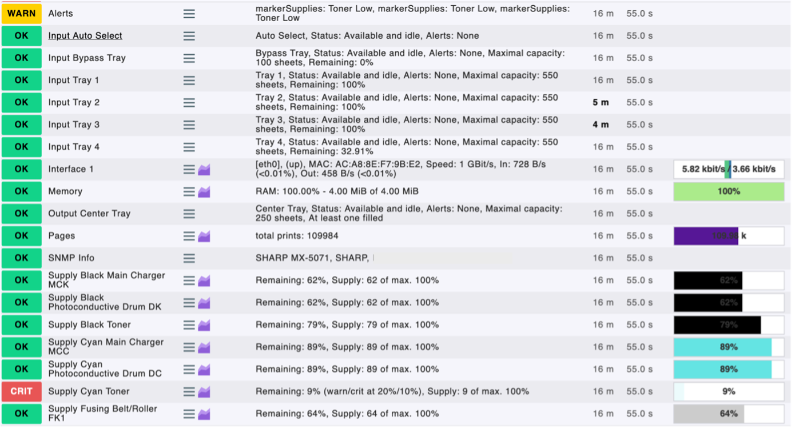
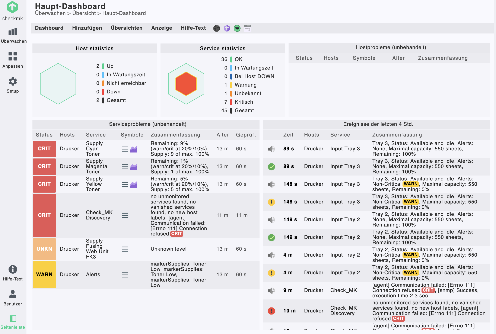
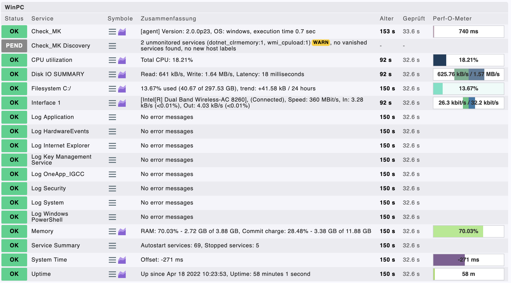
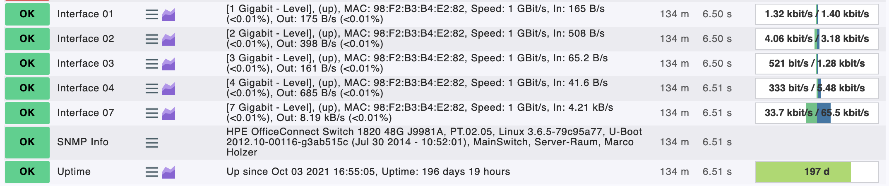
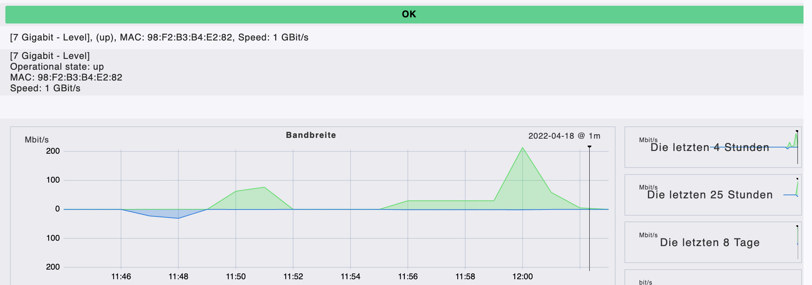

import ReactDisqusComments from 'react-disqus-comments';
import LazyLoad from 'react-lazy-load';

# 1 | Einleitung IT Monitoring

Die Bereitstellung von neuer Software bzw. neuer Services in der IT ist leichter denn je. Konzepte wie Cloud-Computing,
DevOps und Virtualisierung sind etabliert und bereits seit geraumer Zeit im produktiven Einsatz.
Die Systeme und Elemente, die eine ganze IT-Infrastruktur ausmachen, werden flexibel und agil entwickelt,
um den schnellen Veränderungen in der IT-Branche gerecht zu werden.
Diese IT-Systeme sind meist auch geografisch verteilt und laufen auf verschiedensten Betriebssystemen.
Diese Situation macht es nötig, das IT Monitoring-Thema neu zu denken, um den sich ständig ändernden Anforderungen gerecht zu werden [1].

IT Monitoring oder Netzwerk Monitoring ist in Enterprise-Umgebungen ein kritischer Erfolgsfaktor,
um sicherzustellen, dass alle (Produktiv-)Systeme durchgehend erreichbar sowie funktions- und leistungsfähig sind.
Netzwerkkomponenten wie Router, virtuelle Maschinen, Server und Firewalls sollen hinsichtlich ihrer Verfügbarkeit,
Leistung und eventueller Fehler überwacht werden, um so eine proaktive Fehlerbehebung zu gewährleisten [2].

Folgende Aspekte sind grundlegend, um IT Monitoring umsetzen zu können [2]:

- Auswahl der Protokolle (z.B. SNMP - siehe Kapitel 2.1.1)
- Definition der zu überwachenden Elemente
- Definition der Monitoring-Intervalle
- Definitionen der Schwellwerte (kritischen Systemwerte)

Viele Unternehmen müssen rund um die Uhr sicherstellen, dass ihre Systeme hochverfügbar sind.
Deswegen ist es für (IT-)Unternehmen extrem wichtig, sich mit IT Monitoring auseinanderzusetzen.
In diesem Blogeintrag werden die Eigenschaften, Protokolle und diverse Lösungen für das IT Monitoring aufgezeigt.
Abschließend werden anhand eines Praxisbeispiels die Grundfunktionalitäten des IT Monitoringsystems Checkmk erläutert.

# 2 | IT Monitoring Grundlagen

In diesem Kapitel werden die wichtigsten IT Monitoring-Grundlagen erklärt.
Dabei wird Bezug auf das SNMP-Protokoll genommen.

## 2.1 | IT Monitoring Protokolle / Techniken

Beim IT Monitoring werden üblicherweise Protokolle verwendet, welche möglichst wenig Netzwerkbandbreite erfordern.
Die meisten Endgeräte unterstützen ein oder mehrere IT Monitoring Protokolle. Bei Linux kommt SNMP und auch CLI zum Einsatz,
während sich Windows-Systeme auf deren proprietäres Protokoll WMI (Windows Management Instrumentation) beschränken [2].

SNMP ist dabei eines der weitverbreitetsten Protokolle und wird von vielen gängigen (Enterprise-)Netzwerkkomponenten
unterstützt. Jedoch gibt es noch eine Vielzahl an anderen Protokollen wie NETCONF und Netflow, die in den nachfolgenden
Unterkapiteln noch genauer beschrieben werden.

### 2.1.1 | Simple Network Management Protocol (SNMP)

Die erste SNMP Version wurde 1990 auf den Markt gebracht und wird bis heute ständig weiterentwickelt.
Die Kernfunktionalität gewährleistet eine zentrale Überwachung und auch Steuerung der Netzwerkkomponenten einer
Netzwerktopologie. Für den Transport wird das verbindungslose UDP-Protokoll verwendet, um eine geringe
Bandbreitenauslastung zu erreichen. Die Informationen über die Endgeräte werden in der sogenannten Management
Information Base (MBI) als Baumstruktur gespeichert und abgelegt [3].

Die Netzwerküberwachung mit SNMP läuft über ein Agenten-Manager-Modell, das heißt, es gibt eine zentrale
Verwaltungsstelle (Management-Software), die die SNMP-Daten bekommt und verwaltet. Auf den Endgeräten wird ein
SNMP-Agent installiert/aktiviert, der die Daten gesammelt an die Management-Software
(Beispiel für eine Management-Software: Checkmk) schickt [3].

Das SNMP-Protokoll hat sich über die Jahre weiterentwickelt und liegt mittlerweile in der Version 3 vor [3].

### 2.1.1.1 | SNMPv1

SNMPv1 ist die erste Version des SNMP-Protokolls und bietet die Basis für die Kommunikation im Agenten-Manger-Modell. SNMPv1 ist als unsicher zu betrachten, da die SNMP-Pakte unverschlüsselt über das Netzwerk geschickt werden. Version 1 bietet als einzigen Sicherheitsmechanismus einen Community-String, welche wie ein Passwort funktioniert, um auf die Daten der Netzwerkgeräte zugreifen zu können. Der Community-String wird jedoch in Klartext übertragen und ist somit nicht sicher [4].

### 2.1.1.2	| SNMPv2

SNMPv2 setzt auf Version 1 auf und bietet optimierte Fehlerbehandlungen, Abfragen mehrerer Daten in einem einzelnen Request, Manger-zu-Manger-Kommunikation sowie angepasste Kommandos, an. Der Community-String wird in dieser Version verschlüsselt und es werden Benutzernamen eingeführt, um die Sicherheit zu erhöhen [5].

### 2.1.1.3	| SNMPv3

SNMPv3 ist die aktuelle Version und fokussiert sich hauptsächlich auf den Sicherheitsaspekt, der in ersten beiden Versionen vernachlässigt wurde. Der Community-String wurde durch einen Usernamen und Password ersetzt und die übertragenen SNMP-Pakte werden nun ebenfalls verschlüsselt [6].

### 2.1.2 | Network Configuration Protocol (NETCONF)

Das NETCONF-Protokoll ist ein weiterer Schritt in Richtung automatisiertes Netzwerkmonitoring. Das Protokoll basiert auf XML-Files und kann mit sogenannten XML-RPC (Remote Procedure Calls) Daten austauschen. Das Protokoll verfügt über Installations-, Manipulations- und Lösch-Mechanismen für unterstützte Netzwerkkomponenten. Ein großer Vorteil von NETCONF sind die Konfigurationsänderungen durch Transaktionen, an denen mehrere Komponenten beteiligt sein können [7].

### 2.1.3 | Netflow

Netflow ist eine Technologie, die den Datenfluss eines Netzwerkes überwachen kann. Die Technik bietet statistische Informationen über den Paketfluss unterstützter Netzwerkkomponenten. Wird ein Layer-3-Switch an einem Port mittels Netflow überwacht, so speichert Netflow die Daten im Cache des Switches. Ist der Cache voll oder andere Bedingungen treten ein, so exportiert der Switch die Daten zu einem zentralen Collector, um diese zu persistieren und analysieren [8].

## 2.2 | Überwachung grundlegender Elemente

Grundsätzlich sollte die gesamte Infrastruktur, vor allem im Unternehmenssetting, analysiert und beschrieben werden. Dies bringt nicht nur eine komplette und transparente Übersicht über alle Netzwerkkomponenten, sondern auch, welche Geräte eine unkritische oder kritische Rolle für das Unternehmen spielen. Es hängt natürlich davon ab, welche Dienstleistungen und Produkte ein Unternehmen anbietet, um die Infrastruktur zu klassifizieren [2].

Server, Router und Switches übernehmen in den allermeisten Fällen eine geschäftskritische Aufgabe. Bei Ausfall dieser Komponenten könnten Dienstleistungen oder Produkte des Unternehmens komplett stillstehen [2].

Desktops und Drucker werden eher als unkritisch angesehen, da keine direkten Dienstleistungen oder Produkte des Unternehmens ausfallen [2].

Natürlich hängt es vom Unternehmen und der Branche ab, was als kritisch oder unkritisch anzusehen ist.

## 2.3 | Monitoring-Intervalle

Das Monitoring-Intervall gibt an, wie häufig eine Netzwerkkomponente abgefragt wird. Die Netzwerkkomponenten liefern nach einer definierten Zeit Kennzahlen und Leistungs- und Verfügbarkeitsstatus ab. Grundsätzlich soll für die IT-Komponenten eines Unternehmens ein passendes Monitoring-Intervall gewählt werden, um die Netzwerkauslastung gering zu halten [2].

Welches Intervall passend ist, hängt von den Netzwerkparametern (Services), deren eventuell kritische Funktion und Art des Netzwerkgerätes ab. Auch hängt es vom Monitoring-Management-System ab, welche Intervalle es für bestimmte Geräte unterstützt [2].

Folgende Intervallabfragen können als Richtwert angesehen werden [2]:

- Geräteverfügbarkeitsabfrage im Minutentakt
- CPU- und Speicherstatistikabfragen alle fünf Minuten
- Festplattenauslastung alle 15 Minuten


Kürzere Abfrageintervalle würden das Netzwerk nur unnötig belasten, da nur kritische Aspekte wie Geräteverfügbarkeit von enormer Bedeutung sind [2].

## 2.4 | Kritische Schwellenwerte

Die Schwellenwerte dienen dazu, um die Netzwerkgeräte und Server proaktiv zu überwachen. Hier können Werte gesetzt werden, um in Extremfällen noch genügend Reaktionszeit zu haben. Üblicherweise ist es möglich, individuelle Schwellenwerte pro Gerät zu setzten. Es können auch Benachrichtigungen (z.B. E-Mails) gesetzt werden, um in Extremfällen rechtzeitig agieren zu können [2].

Zum Beispiel könnte auf einem Server ein Festplattenschwellenwert gesetzt werden. Dieser Wert soll eine 80-prozentige Festplattenauslastung nicht überschreiten, da es sein könnte, dass Daten nicht mehr gespeichert werden können. Somit kann der IT-Administrator oder die IT-Administratorin rechtzeitig reagieren und eine weitere Festplatte installieren, um eine lückenlose Verfügbarkeit gewährleisten zu können.

# 3 | IT Monitoring Lösungen

Für das Monitoring von IT-Infrastrukturen und IT-Services gibt es eine Vielzahl von verschiedenen Tools, weshalb nachfolgend nur ein kleiner Ausschnitt gezeigt wird.


## 3.1 | Nagios

Die Monitoring-Lösung Nagios wurde bereits 1999 veröffentlicht und wird seitdem stetig weiterentwickelt. Auf der offiziellen Website nagios.org werden mittlerweile viele verschiedene Produkte – unter anderem Nagios XI, Nagios Log Server, Nagios Network Analyzer und Nagios Fusion – angeboten. Hierbei sollte allerdings darauf geachtet werden, dass nur die Basisversion „Nagios Core“ kostenlos (im Sinne einer GNU General Public License) ist [9].

Nagios Core selbst inkludiert keine Mechanismen für das Monitoring von Services, sondern führt dafür sogenannte Plugins aus. Die nachfolgende Abbildung verdeutlicht den Aufbau des Monitorings mit Nagios.


<center>Abbildung 1: Monitoring mit Nagios [10]</center>

Die Plugins dienen demnach als Abstraktionsebene zwischen dem eigentlichen Prozess von Nagios und den zu überwachenden Hosts und Services. Plugins können ausführbare Programme oder Skripts in diversen Programmiersprachen (wie zum Beispiel Perl, PHP oder Python) sein, was den Entwicklerinnen und Entwicklern die Möglichkeit gibt, individuell zugeschnittene Plugins zu erstellen. Für das Überwachen von Standard-Hosts und -Services (z.B. FTP, SMTP und SSH) werden vorgefertigte Plugins zum Download angeboten [10].

## 3.2 | Zabbix

Die Monitoring-Lösung Zabbix wurde von Alexei Vladishev entwickelt und 1998 erstmals veröffentlicht. Aktiv weiterentwickelt und unterstützt wird die Software derzeit von Zabbix SIA/LCC. Zabbix wird unter der GPL General Public License Version 2 entwickelt und vertrieben und kann daher kostenlos verwendet werden [11].

Die Architektur von Zabbix besteht aus einigen wichtigen Softwarekomponenten, welche in der nachfolgenden Auflistung kurz erklärt werden [12]:


- <strong>Server:</strong> Der Zabbix-Server ist die zentrale Komponente in der Architektur. Er dient als zentraler Speicherort für sämtliche Konfigurations- und Betriebsdaten und für Statistiken.
- <strong>Agents:</strong> Agents sind kleine Programme, welche auf den zu überwachenden Systemen installiert werden und die aktive Ressourcen- und Applikationsüberwachung übernehmen. Die gesammelten Daten werden an den Server übermittelt.
- <strong>Webinterface:</strong> Für den standort- und plattformunabhängigen Zugriff inkludiert der Zabbix Server ein webbasiertes Interface, welches üblicherweise auf demselben physischen Gerät gehostet wird.
- <strong>Proxy:</strong> Der Zabbix-Proxy ist ein optionaler Teil der Architektur und kann gesammelte Monitoring-Daten in verteilten Umgebungen entgegennehmen und diese anschließend gesammelt an den Server übermitteln.


Um den Datenfluss in Zabbix abzubilden, sind darüber hinaus folgende logische Elemente von Bedeutung [13]:


- <strong>Host:</strong> Hosts sind Netzwerkgeräte mit einer eigenen IP-Adresse und/oder einem eigenen vollständig qualifiziertem Domainnamen.
- <strong>Item:</strong> Items repräsentieren spezielle Parameter/Eigenschaften von Hosts, welche überwacht werden sollten (z.B. die CPU-Auslastung eines Computers).
- <strong>Trigger:</strong> Trigger definieren einen Schwellwert für Items und ändern ihren Status, wenn der Schwellwert überschritten wurde. 
- <strong>Event:</strong> Wenn sich der Zustand eines Triggers verändert, wird ein Event (= Ereignis) ausgelöst.
- <strong>Actions:</strong> Actions definieren, wie auf das Auslösen eines Events reagiert werden soll. Das könnte zum Beispiel das Senden einer E-Mail sein.


Zusammenfassend kann gesagt werden, dass sich Zabbix insbesondere durch den optionalen Proxy von Nagios unterscheidet. Durch den Proxy können verteilte Umgebungen einfach realisiert werden, was beispielsweise für ein IT-Dienstleistungsunternehmen zur Überwachung von Kunden-Services vorteilhaft sein kann.

## 3.3 | Checkmk

Eine weitere vergleichbare Lösung für das Service-Monitoring von IT-Infrastruktur ist die von der tribe29 GmbH entwickelte Software Checkmk, welche im Jahr 2008 – und damit gut zehn Jahre nach den anderen beiden Lösungen – erstmals veröffentlicht wurde. Entwickelt wurde Checkmk in den Programmiersprachen C++ und Python [15].

Neben der Open-Source-Version „Checkmk Raw Edition (CRE)“ gibt es noch die kommerzielle „Checkmk Enterprise Edition (CEE)“ und die Version für Managed Service Provider „Checkmk Enterprise Managed Services Edition (CME)“. CEE darf bis zu einer Anzahl von 25 überwachten Hosts kostenlos verwendet werden. Hervorzuheben ist, dass Checkmk früher auf Nagios basierte. Die Raw Edition basiert im Kern auch heutzutage noch auf Nagios [14].

Auch Checkmk verwendet einige Kernelemente und Begriffe, die nachfolgend aufgelistet werden [15]:

- <strong>Events:</strong> In der Dokumentation von Checkmk wird erklärt, dass die meisten Monitoring-Lösungen ereignisbasiert arbeiten. Events sind einzigartige Geschehnisse, die zu einem bestimmten Zeitpunkt auftreten.
- <strong>States:</strong> Im Gegensatz zu den Events beschreiben Zustände anhaltende Situationen. Beispiel: „AccessPoint 1 ist online“. Um den Zustand bewerten zu können, muss das Monitoring-System den AccessPoint regelmäßig abfragen. Checkmk beherrscht Events und States, bevorzugt jedoch aus verschiedenen Gründen die States.
- <strong>Hosts:</strong> Laut der Checkmk-Dokumentation handelt es sich bei Hosts primär um Netzwerkgeräte wie zum Beispiel Server, Switches, Router und sonstige IP-fähige Netzwerkgeräte. 
- <strong>Parents:</strong> Bei jedem Host können ein oder mehrere Parent-Hosts angegeben werden, wodurch Checkmk in der Lage ist, eine baumartige Host-Struktur abzuleiten. Mithilfe dieser Struktur kann Checkmk beispielsweise erkennen, dass mehrere Hosts, bedingt durch den Ausfall eines zentralen Switches, nicht mehr erreichbar sind. Dadurch können Fehlalarme vermieden werden. 
- <strong>Services:</strong> Auf jedem Host gibt es eine Menge von Services. Services sind wesentliche Teile und Eigenschaften des Hosts, die überwacht werden können. Bei einem Switch sind beispielsweise sowohl die Uptime des Gerätes als auch jedes einzelne Netzwerkinterface als eigener Service zu betrachten. 
- <strong>Contacts</strong> und <strong>Contact Groups:</strong> Durch die Verwendung von Kontakten und Kontaktgruppen können Hosts und Services Personen zugeordnet werden.
- <strong>Users</strong> und <strong>Roles:</strong> In Verbindung mit den Kontakten und Kontaktgruppen wird über Benutzer und Rollen gesteuert, welche Personen für bestimmte Hosts oder Services zuständig sind. Checkmk kommt mit den Standardrollen „admin“, „user“ und „guest“.
- <strong>Problems:</strong> Alle Hosts und Services, die sich nicht im gewünschten Zustand befinden, werden nach Checkmk-Terminologie als „Problem“ bezeichnet.
- <strong>Notifications:</strong> Immer, wenn sich der State eines Service ändert, spricht man bei Checkmk von einem Monitoring-Event. Üblicherweise generieren solche Events eine Benachrichtigung in Form einer E-Mail an den verknüpften Contact.
- <strong>Time Periods:</strong> Eine Zeitperioden kann festgelegt werden, innerhalb welcher Zeitspanne die Überwachung und eine allfällige Benachrichtigung erfolgen soll.

Im Vergleich zu Nagios und Zabbix wirken die Kernelemente von Checkmk deutlich feingranularer. Das könnte auch damit zu tun haben, dass die Basisversion von Checkmk eben deutlich neuer ist.

# 4 | Praxisbeispiel mittels Checkmk

Dieses Kapitel zeigt die Umsetzung eines Monitoringsystems mittels Checkmk anhand eines kleinen Praxisbeispiels.

## 4.1 | Infrastruktur

Überwacht werden ein zentraler Switch von HP, ein Multifunktionsgerät von Sharp und ein Client-PC der Marke Dell. Während auf dem Client (Betriebssystem: Windows 10) ein Agent installiert werden musste, übermitteln der Switch und der Drucker die Daten bereits standardmäßig per SNMP.

Die nachfolgende Grafik veranschaulicht den Aufbau des Testnetzwerkes.


<center>Abbildung 2: Visualisierung der Demoumgebung</center>

Wie in der Grafik zu erkennen ist, befinden sich außerdem noch ein weiterer Client und ein Fileserver im Netzwerk. Beide Geräte dienen allerdings nur zum Testen der Switchport-Überwachung und sind selbst nicht in das Monitoringsystem eingebunden.

## 4.2 | Installation von Checkmk mittels Docker

Die Installation des Checkmk-Servers wurde mit Docker gelöst. Natürlich kann der Server auch nativ auf das Hostsystem (z.B. Debian) installiert werden. Die Lösung mittels Docker ist intuitiv und einfach durchzuführen. Hierbei wird in der Command-Line nur ein Befehl ausgeführt, der die Checkmk-Server-Datei von DockerHub herunterlädt und direkt in einen Docker-Container deployed. Mit diesem Befehl wird nicht nur ein Docker-Container mit Checkmk erstellt, sondern auch ein Webinterface namens cmk eingerichtet und gestartet. Diese Website ist sofort für eine Anmeldung mit dem Standarduser <em>cmkadmin</em> verfügbar [15].

#### Folgender Befehl wurde im Command Line Interface ausgeführt:
<br/><br/>

```
docker container run
-dit -p 8080:5000
--tmpfs /opt/omd/sites/cmk/tmp:uid=1000,gid=1000
-v monitoring:/omd/sites --name monitoring
-v /etc/localtime:/etc/localtime:ro
--restart always checkmk/check-mk-raw:2.0.0-latest
```

Da der obenstehende Befehl aus mehreren Parametern besteht, wird nur auf die wichtigsten Eigenschaften eingegangen. Die vollständige Erklärung des Befehls findet man auf der Dokumentationswebsite von Checkmk
([hier klicken](https://docs.checkmk.com/latest/en/introduction_docker.html)).

- <strong>-p 8080:5000:</strong> Als Standardeinstellung liegt der Checkmk-Server auf Port 8080, der interne Port von Docker benutzt 5000. Diese Porteinstellungen können natürlich je nach Anwendungsfall geändert werden.
- <strong>--name monitoring:</strong> Dieser Befehl gibt den Namen des Docker-Containers an, der eindeutig sein muss.
- <strong>checkmk/check-mk-raw:2.0.0-latest:</strong> Die Bezeichnung des Checkmk-Images, das heruntergeladen wird.

Wurde der Befehl erfolgreich ausgeführt, kann der Checkmk-Server unter der URL <em>http://localhost:8080/cmk/check_mk/</em> erreicht werden. Die Anmeldedaten findet man beim Starten des Docker-Containers in den dazugehörigen Docker-Logs.

## 4.3 | Einbinden von Hosts

Nach dem Einloggen in den Checkmk-Server kommt man auf das Haupt-Dashboard. Hier sind noch keine Monitoring-Services eingetragen. Im nächsten Schritt muss der User zum Reiter Hosts auf der linken Seite navigieren. Wie in der unteren Abbildung ersichtlich, müssen die benötigten Eigenschaften der Netzwerkkomponente eingegeben werden.

Es wird ein Drucker hinzugefügt, der unter der IP-Adresse 10.225.0.1 erreichbar ist. Da der Drucker SNMP unterstütz, wurde dieses Protokoll zur Datenübertragung verwendet. In unserem Testnetzwerk reicht die erste SNMP-Version, doch wie bereits im IT Monitoring Protokoll / Techniken Kapitel beschrieben, sollte eine höhere SNMP Version verwendet werden, da diese bessere Sicherheitsmechanismen unterstützen.


<center>Abbildung 3: Grundkonfiguration eines Hosts</center>

Nachdem die Verbindung hergestellt wurde, zeigt Checkmk an, welche Services des Hosts abgefragt werden können. In der darunter stehenden Abbildung können die abgefragten Drucker-Services eingesehen werden. Hier zeigt Checkmk direkt den Status der jeweiligen Parameter (WARN, OK, CRIT) an. Da der kritische Schwellwert der einzelnen Parameter nicht manuell eingegeben wurde, nimmt Checkmk die Werte intern an. Zum Beispiel ist der türkise Toner (Cyan) bei einem Tonerfüllstand von 9% und Checkmk nimmt dies somit als kritischen Schwellwert an.


<center>Abbildung 4: Übersicht über die überwachten Services</center><br/>

## 4.4 | Haupt-Dashboard

Nachdem die Hosts hinzugefügt wurden, sind die empfangenen SNMP-Daten des Hosts im Haupt-Dashboard ersichtlich.
Das Dashboard wird in fünf Standardmenüs unterteilt, die natürlich nach belieben geändert werden können.
Auf der oberen linken Seite sieht man die <strong>Host-Statistiken</strong>, welche die Up- und Downzeiten der Komponenten anzeigen.
Rechts neben den Host-Statistiken befinden sich die <strong>Service-Statistiken</strong>, die einen Überblick über alle Netzwerkparameter liefern.
Darunter stehen alle <strong>Serviceprobleme</strong> der hinzugefügten Netzwerkkomponenten, die als CRIT (kritisches Problem), UNKN (Unbekannter Wert) und WARN (Warnung) angesehen werden.
Auf der unteren rechten Hälfte des Haupt-Dashboards befindet sich eine Übersicht über die <strong>Ergebnisse der letzten 4 Stunden</strong>.

Somit liegt beim Standarddashboard der Fokus auf die kritischen Schwellwerte der Hosts, um diese so schnell wie möglich behandeln zu können.


<center>Abbildung 5: Haupt-Dashboard</center><br/>

## 4.5 | Agentenbasierte Einbindung von Hosts

Neben der Möglichkeit, Hosts mittels SNMP einzubinden, bietet Checkmk auch die Möglichkeit, einen Agent auf dem Hostsystem zu installieren. In unserem Testnetzwerk wurde noch ein Windows-Client-PC überwacht, der standardmäßig über kein SNMP verfügt. Der Checkmk-Server bietet den Download eines Agents für verschiedene Betriebssysteme an. Unter Windows muss der Client-PC die Agenten.msi-Datei installieren, um mit dem Checkmk-Server kommunizieren zu können. Ist der Agent installiert, muss dieser - wie bereits im Kapitel Einbinden von Hosts – erklärt, mittels Checkmk Agent eingebunden werden. Erkennt der Server den Windows-Client-PC, können nachfolgende PC-Parameter abgefragt werden (siehe Abbildung).


<center>Abbildung 6: Monitoring eines Windows-PCs über den Checkmk Agenten</center>

Der Windows-Client-PC liefert Daten wie die Auslastung des C-Laufwerks, CPU-Auslastung, Netzwerkbandbreitennutzung (Interface 1) und vieles mehr. Nach dem Hinzufügen des Windows-Client-PCs im Checkmk-Server, sind nun die Serviceeigenschaften im Haupt-Dashboard ersichtlich.

Die Agentensoftware von Checkmk steht auch für Linux und Docker zur Verfügung.

## 4.6 | Netzwerkauslastungstest an einem Switch-Interface

Der Switch, der im Testnetzwerk vorhanden ist, wurde auch mittels SNMP-Protokoll in Checkmk integriert. Die SNMP-Abfrage liefert die Uptime des Switches und die aktiven Interfaces (Ports).


<center>Abbildung 7: Monitoring eines Netzwerkswitches</center>

Im unserem Auslastungstest wurde eine 1 GB und anschließend eine 10 GB große Datei auf den Fileshare hochgeladen. Der Fileshare ist mit dem Switch auf Interface 7 verbunden. Dabei fungiert der Windows-Client-PC, der auch in Checkmk eingebunden wurde, als Uploader der Dateien.


- <strong>1 GB Datei:</strong> Um 11:49 begann der Upload und endete um 11:52. Im grünen Bereich des Graphen sieht man auf der y-Achse die Auslastung des Interfaces, welche bei 80 Mbit/s ihr Maximum erreicht hat.
- <strong>10 GB Datei:</strong> Um 11:55 begann der Upload und endete um ca. 12:02. Dabei ist zu erkennen, dass das Switch-Interface erst bei der halben Uploadzeit die Übertragung erhöhte. Die maximale Übertragungsrate betrug dabei ca. 200 Mbit/s.



<center>Abbildung 8: Monitoring der Auslastung eines einzelnen Interfaces an einem Switch</center>

Es ist zu erkennen, dass jede Übertragung mitprotokolliert und auch übersichtlich dargestellt wird. Somit ist es jederzeit möglich, zu erkennen, ob es Netzwerkprobleme gibt. Außerdem können sogenannte Bottlenecks erkennt werden, deren Grund in einer Überlastung des Interfaces liegen kann. Obwohl es in unserem Testbeispiel kein Bottleneck gibt, besitzt der Netzwerkadministrator oder die Netzwerkadministratorin nun ein Tool, welches die Fehlersuche enorm erleichtert und bei der proaktiven Erkennung von Bottlenecks helfen kann.

# 5 | Fazit

Im Rahmen der ersten drei Kapitel dieses Blogeintrags erhält die lesende Person einen Kurzüberblick über die wichtigsten Begriffe und Werkzeuge für den Aufbau eines einfachen Monitoring-Systems. Darauf aufbauend erfolgt im vierten Kapitel die Umsetzung anhand eines Praxisbeispiel mit dem Tool Checkmk – einer sehr modernen und leicht aufzusetzenden Monitoring-Software, die noch dazu in einer Open-Source-Version verfügbar ist. Durch den theoretischen und anschließend ebenso praxisnahen Ansatz dieser Arbeit können IT-affine Personen bereits ein gutes Grundverständnis für das Thema Monitoring erwerben und ein einfaches Monitoring-System einrichten.

Dieser Blogeintrag verdeutlicht, dass ein konsistentes Monitoring von IT-Hosts und -Services heutzutage immer wichtiger wird. Insbesondere bei geografisch verteilten Umgebungen und der hybriden Nutzung von lokaler Infrastruktur und Cloudservices kann ein ausgeklügeltes Monitoringsystem sehr hilfreich für das rasche Erkennen und – optimalerweise präventive – Vermeiden von ungewünschten Zuständen sein. Davon profitieren einerseits IT-Administratorinnen und -Administratoren, da diese den Zustand sämtlicher Services in einem übersichtlichen Dashboard sehen können und diese nicht einzeln überwachen müssen und andererseits sämtliche IT-User in einer Organisation, welche von einer beschleunigten Fehlerbehebung und präventiven Maßnahmen – wie etwa einem Festplattenaustausch oder einer Verstärkung des Netzwerks – profitieren. Letztendlich bringt ein gut implementiertes Monitoring einen Vorteil für die gesamte Organisation/das gesamte Unternehmen, welches durch eine effizientere IT wettbewerbsfähiger wird und diese nicht mehr nur als Cost-Center betrachtet.

# 6 | Quellen

[1] 	G. G. a. N. S. J. Hernantes, „IT Infrastructure-Monitoring Tools,“ EEE Software, Nr. vol. 32, no. 4, pp. pp. 88-93, July-Aug. 2015.

[2] 	Nithin.S, „ManageEngine,“ [Online]. Available: https://www.manageengine.de/fileadmin/user_upload/02_Produkte-Loesungen/OpManager/E-Book-Network-Monitoring-Grundlagen-OpManager.pdf. [Zugriff am 09 05 2022].

[3] 	Ionos, „Ionos,“ 27 09 2018. [Online]. Available: https://www.ionos.at/digitalguide/server/knowhow/snmp-simple-network-management-protocol/. [Zugriff am 09 05 2022].

[4] 	I. Standard, „A Simple Network Management Protocol (SNMP),“ 05 1990. [Online]. Available: https://datatracker.ietf.org/doc/html/rfc1157. [Zugriff am 09 05 2022].

[5] 	I. Standard, „Introduction to Community-based SNMPv2,“ 01 1996. [Online]. Available: https://datatracker.ietf.org/doc/html/rfc1901. [Zugriff am 09 05 2022].

[6] 	I. Standard, „User-based Security Model (USM) for version 3 of the Simple Network Management Protocol (SNMPv3),“ 12 2002. [Online]. Available: https://datatracker.ietf.org/doc/html/rfc3414. [Zugriff am 09 05 2022].

[7] 	J. a. A. A. I. Yu, „An Empirical Study of the NETCONF Protocol,“ 2010 Sixth International Conference on Networking and Services, 2010.

[8] 	Y. a. S. J. a. S. R. a. W. Y. Liu, „Next Generation Internet Traffic Monitoring System Based on NetFlow,“ 2010 International Conference on Intelligent System Design and Engineering Application, 2010.

[9] 	Nagios Enterprises, „The Nagios IT Management Software Suite,“ [Online]. Available: https://www.nagios.com/products/. [Zugriff am 24 Mai 2022].

[10] 	Nagios Enterprises, „Nagios Docs,“ [Online]. Available: https://assets.nagios.com/downloads/nagioscore/docs/nagioscore/4/en/plugins.html. [Zugriff am 24 Mai 2022].

[11] 	Zabbix SIA, „What is Zabbix,“ [Online]. Available: https://www.zabbix.com/documentation/current/de/manual/introduction/about. [Zugriff am 24 Mai 2022].

[12] 	Zabbix SIA, „Zabbix Overview,“ [Online]. Available: https://www.zabbix.com/documentation/current/de/manual/introduction/overview. [Zugriff am 24 Mai 2022].

[13] 	Zabbix SIA, „Definitions,“ [Online]. Available: https://www.zabbix.com/documentation/current/de/manual/definitions. [Zugriff am 24 Mai 2022].

[14] 	tribe 29 GmbH, „Checkmk aufsetzen,“ 6 April 2022. [Online]. Available: https://docs.checkmk.com/latest/de/intro_setup.html. [Zugriff am 24 Mai 2022].

[15] 	Checkmk, „docs.checkmk.com,“ 08 06 2021. [Online]. Available: https://docs.checkmk.com/latest/en/introduction_docker.html. [Zugriff am 24 05 2022].

<center><Text style={{ fontSize: '1vw', fontWeight: 'bold', color: 'heading' }}>Verfasser: Bernhard Ebner, Marco Holzer</Text></center>

<br></br>
<hr/>
<br></br>
<center>
<div style={{backgroundColor: '#ffffff', width: '100%', borderRadius:'2%'}}>
<div style={{backgroundColor: '#ffffff', width: '90%', maring:'0 auto', display: 'table',borderRadius:'2%'}}>
<LazyLoad offset={1000}>
<ReactDisqusComments
        shortname="bebner"
        identifier="itmonitoring"
        title="Wie funktioniert eigentlich IT Monitoring?"
        url="https://www.bebner.eu/blog/it-monitoring"
/>
</LazyLoad>
</div>
</div>
</center>